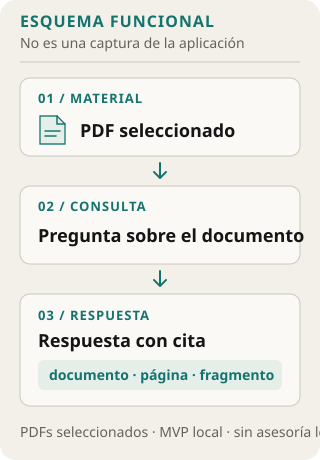
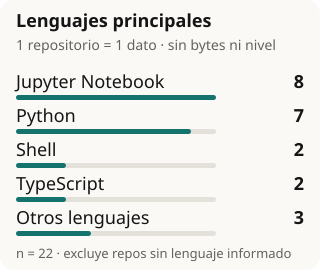

# Hola, soy Diego Román 👋

Estudio Ciencia de la Computación en la Universidad Nacional de Ingeniería (UNI) desde 2022. En mis proyectos exploro aplicaciones full stack con IA aplicada: investigación documental con citas, planificación de estudio, herramientas de IA para notas y experimentos de machine learning. Cuando una respuesta se apoya en documentos, me importa que sus fuentes se puedan revisar.

[Ver mi portafolio](https://diegoromanp.github.io/DiegoRomanP/) · [Explorar repositorios públicos](https://github.com/DiegoRomanP?tab=repositories)

## Enfoque

Me interesa que, cuando una herramienta responde sobre documentos, el recorrido hasta la fuente pueda revisarse. En LexiTrace eso se concreta en citas al documento, la página y el fragmento; en otros proyectos exploro planificación de estudio, acciones de IA para notas y experimentos de machine learning.

## Proyectos destacados

### [LexiTrace — Evidencia documental con RAG](https://github.com/DiegoRomanP/lexitrace-legal-evidence-rag)

MVP local para investigar PDFs seleccionados y consultar respuestas con citas al documento, página y fragmento. No ofrece asesoría legal.

- **Propósito:** Explorar cómo las respuestas sobre documentos pueden dejar visibles sus fuentes.
- **Alcance:** PDFs seleccionados · citas a documento, página y fragmento · no es asesoría legal.
- **Stack:** FastAPI · React · TypeScript · SQLite · Qdrant.

### [StudyAI — Planificación y repaso de estudio](https://github.com/DiegoRomanP/StudyAI)

Organiza planes desde documentos y metas en sesiones, materiales y cuestionarios, con repaso espaciado SM-2. El LLM simulado se usa por defecto; el RAG semántico es opcional.

- **Propósito:** Convertir objetivos y material de estudio en una planificación por sesiones.
- **Alcance:** Documentos y metas · materiales y cuestionarios · repaso SM-2 · LLM simulado por defecto, RAG opcional.
- **Stack:** FastAPI · React · TypeScript.

### [Context IA Obsidian — Acciones de IA para notas](https://github.com/DiegoRomanP/context-ia-obsidian)

Plugin TypeScript para resumir o explicar notas, investigar con fuentes y generar imágenes.

- **Propósito:** Explorar acciones de IA integradas al flujo de notas en Obsidian.
- **Alcance:** Resumir y explicar notas · investigar con fuentes · generar imágenes.
- **Stack:** TypeScript.
- **Release:** [Release v0.1.0](https://github.com/DiegoRomanP/context-ia-obsidian/releases/tag/v0.1.0).

### [Give me some Credit — Experimento de predicción crediticia](https://github.com/DiegoRomanP/Give-me-some-Credit)

Experimento de predicción crediticia con XGBoost que compara métodos de balanceo.

- **Propósito:** Explorar el efecto de distintas estrategias de balanceo en un experimento de clasificación crediticia.
- **Alcance:** XGBoost · comparación de métodos de balanceo · API FastAPI e interfaz Streamlit.
- **Stack:** XGBoost · FastAPI · Streamlit · Docker.

## GitHub en cifras

Actualizado: **2026-10-03 03:16 UTC**. Datos públicos del [perfil de GitHub](https://api.github.com/users/DiegoRomanP) y de sus [repositorios](https://api.github.com/users/DiegoRomanP/repos?type=owner&per_page=100).

| Métrica pública | Valor |
|:--|--:|
| Repositorios propios públicos (sin forks) | 23 |
| Estrellas en esos repositorios | 1 |
| Seguidores de la cuenta | 6 |

El lenguaje principal declarado se cuenta una vez por repositorio; los que no informan lenguaje quedan fuera del denominador. No representa bytes de código ni nivel de dominio.

**Conteos por repositorio:** Jupyter Notebook: 8 · Python: 7 · Shell: 2 · TypeScript: 2 · CSS: 1 · Java: 1 · JavaScript: 1.

## Tecnologías por área

- **APIs y backend:** Python · FastAPI.
- **Interfaces:** React · TypeScript · Streamlit.
- **Datos e IA aplicada:** RAG · SQLite · Qdrant · XGBoost.
- **Herramientas e integración:** Obsidian · Docker.

## Formación e idiomas

**Ciencia de la Computación — Universidad Nacional de Ingeniería (UNI)** · Estudiante de pregrado · 2022–presente.

Cursos relacionados:
- Estructuras de Datos
- Base de Datos
- Ingeniería de Software
- Sistemas Operativos

Formación complementaria:
- **Diplomado en Ciencia de Datos Avanzada** — Data Mining Consulting · 2025.
- **AI Foundations Associate** — Oracle University · 2025.
- **Claude Code in Action** — Anthropic · 2026.
- **Claude Code 101** — Anthropic.

**Idiomas:** Español nativo · Inglés avanzado (C1), formación en ICPNA.

## Enlaces

[GitHub](https://github.com/DiegoRomanP) · [LinkedIn](https://www.linkedin.com/in/diego-osvaldo-roman-palomino/) · [Portafolio web](https://diegoromanp.github.io/DiegoRomanP/)
